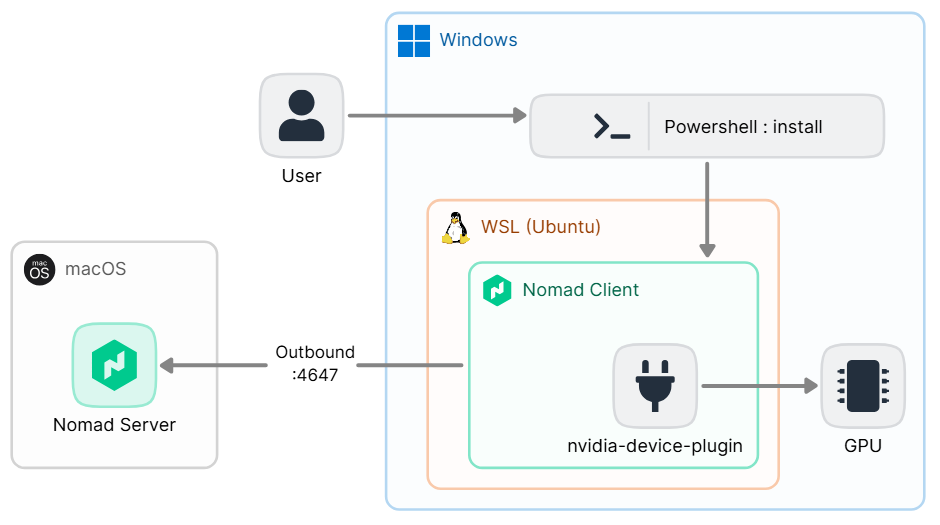
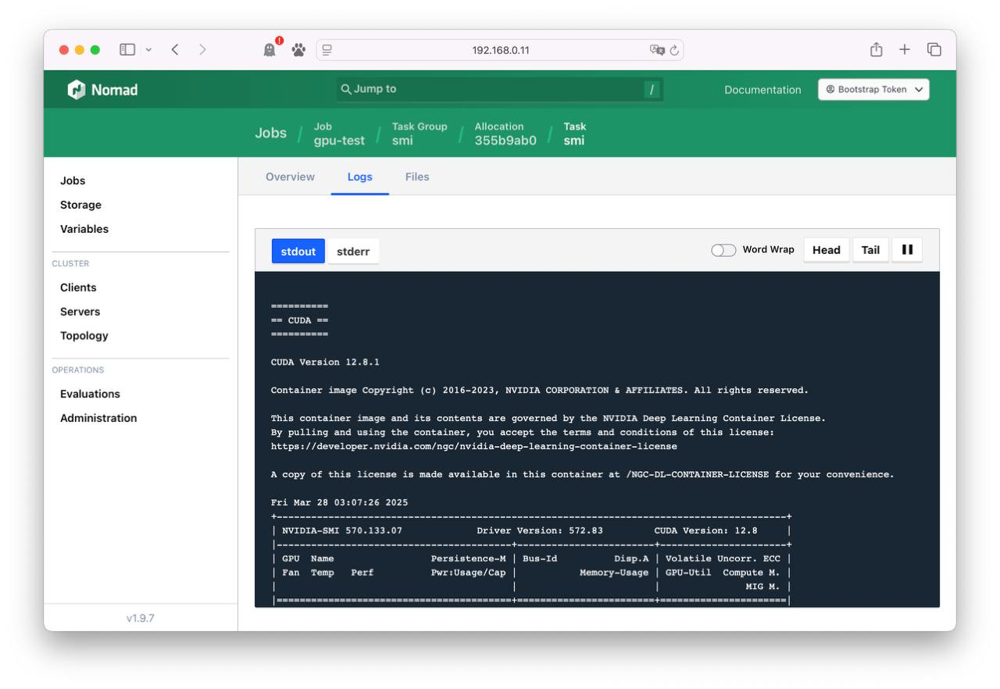
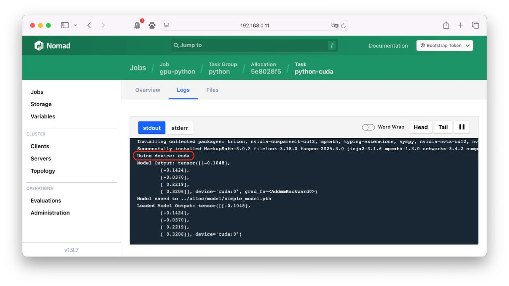
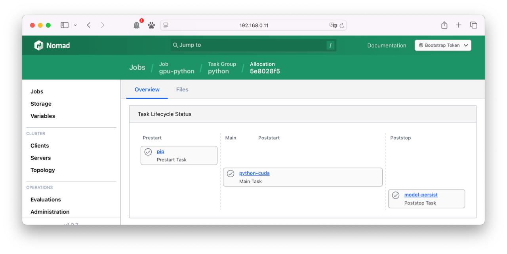

# Nomad client on WSL with NVIDIA plugin

## Requirment

- Windows 10 version 2004 and higher (Build 19041 and higher) or Windows 11
- WSL Ubuntu

## Prerequisite

- Install WSL : <https://learn.microsoft.com/en-us/windows/wsl/install>
- Setup Nomad Server : <https://developer.hashicorp.com/nomad/docs/install>
- Place this script and configuration file under `C:\temp\`.

## High-level architecture



## Install Nomad client on WSL(Ubuntu)

```powershell
powershell -ExecutionPolicy Bypass -File .\install_nomad_on_wsl.ps1
```

- `-ExecutionPolicy Bypass` : This value is intended for use when a PowerShell script is embedded within another application or has its own security settings, and will be blocked or run without any warning.

### Powershell script for installation

In `install_nomad_on_wsl.ps1`, we select the IP of the user's Windows environment and call a script that configures the Nomad client on WSL.

By default, WSL uses a NAT (Network Address Translation)-based architecture for networking. The IP that the Nomad client sees is the IP inside Windows, so we need to declare an `advertise` address for the Nomad server to know the IP of the Windows host.

The corresponding Powershell script retrieves the list of IPs on the network assigned to Windows and selects them.

```powershell
# Apply selected IP
$user_ip = $ip_list[[int]$selection - 1]
Write-Output "Selected IP address: $user_ip"
```

The selected IP is passed as an argument when running the shell script on WSL in Powershell. You will need your WSL user password as it requires `sudo` privileges in the shell.

```powershell
# Running the Nomad client installation script in WSL
Write-Output "Install Nomad Client on WSL"
wsl /mnt/c/temp/nomad_client_setup.sh $user_ip
```

### Shell script to run in WSL

In `nomad_client_setup.sh`, we perform the tasks for running the Nomad client. We install the necessary packages and download the Nomad binary and Nvidia plugin. Nomad is registered as a service and runs.

Install the Nvidia container toolkit and drivers to use Nvidia GPUs in containers.
<https://docs.nvidia.com/datacenter/cloud-native/container-toolkit/latest/install-guide.html>

Since the installation `nvidia-utils-545` is done on `WSL Ubuntu 22.04.2`, you need to pay attention to the versions of Nvidia-related packages.

```bash
# Installing NVIDIA Container Toolkit
curl -fsSL https://nvidia.github.io/libnvidia-container/gpgkey | sudo gpg --dearmor -o /usr/share/keyrings/nvidia-container-toolkit-keyring.gpg \
  && curl -s -L https://nvidia.github.io/libnvidia-container/stable/deb/nvidia-container-toolkit.list | \
    sed 's#deb https://#deb [signed-by=/usr/share/keyrings/nvidia-container-toolkit-keyring.gpg] https://#g' | \
    sudo tee /etc/apt/sources.list.d/nvidia-container-toolkit.list

sudo apt-get update

sudo apt-get install -y ubuntu-drivers-common nvidia-utils-545 nvidia-container-toolkit nvidia-cuda-toolkit

sudo nvidia-ctk runtime configure --runtime=docker
sudo systemctl restart docker
sudo docker info|grep -i runtime

wget https://developer.download.nvidia.com/compute/cuda/12.8.1/local_installers/cuda_12.8.1_570.124.06_linux.run

sudo sh cuda_12.8.1_570.124.06_linux.run --silent --toolkit --toolkitpath=/usr/local/cuda-12.8
```

The IP argument for the `advertise` address passed in from Powershell is replaced with the `ADVERTISE_IP` string value from `nomad.hcl.tpl`.

```bash
# Nomad configuration
sudo sed /mnt/c/temp/nomad.hcl.tpl -e "s/ADVERTISE_IP/$1/g" | sudo tee /etc/nomad.d/nomad.hcl > /dev/null
```

#### Nomad config

Replace your IP address in `advertise` in the install shell script.

```hcl
# nomad.hcl.tpl
advertise {
  http = "ADVERTISE_IP"
  rpc  = "ADVERTISE_IP"
  serf = "ADVERTISE_IP"
}
```

`nomad.hcl.tpl` specifies `IP:Port` for joining to a pre-configured server. These values ​​should be modified to suit your environment. `host_volume` sets the mount location of the Windows volume configured in WSL. If you use a network volume as shared storage on your Windows host, you can mount that network directory in WSL and use it.

```hcl
# nomad.hcl.tpl
client {
  enabled = true
  servers = ["192.168.0.11:4647"]

  host_volume "host_temp" {
    path      = "/mnt/c/temp"
    read_only = false
  }
}
```

## GPU workload test

### Check node status

Check the `nvidia` device under `Device Resource Utilization`.

```bash
[CLI> nomad node status ad1f3d27

ID              = ad1f3d27-3cd1-7b1f-4c77-3c5a068f92a1
Name            = GSWindows
Node Pool       = default
Class           = <none>
DC              = dc1
Drain           = false
Eligibility     = eligible
Status          = ready
CSI Controllers = <none>
CSI Drivers     = <none>
Uptime          = 8h51m24s
Host Volumes    = host_temp
Host Networks   = <none>
CSI Volumes     = <none>
Driver Status   = docker,exec,java,raw_exec

Node Events
Time                       Subsystem     Message
2025-03-28T12:05:07+09:00  Driver: java  Healthy
2025-03-28T11:36:07+09:00  Cluster       Node registered

Allocated Resources
CPU          Memory       Disk
0/51088 MHz  0 B/7.4 GiB  0 B/953 GiB

Allocation Resource Utilization
CPU          Memory
0/51088 MHz  0 B/7.4 GiB

Host Resource Utilization
CPU            Memory           Disk
127/51088 MHz  719 MiB/7.4 GiB  32 GiB/1007 GiB

Device Resource Utilization
nvidia/gpu/NVIDIA GeForce RTX 3060 Laptop GPU[GPU-10177bd8-6d56-c386-0978-fd9b06941a51]  757 / 6144 MiB

Allocations
ID        Node ID   Task Group  Version  Desired  Status    Created     Modified
```

### Container Job sample

Run the following Job. Make sure the tag of the `cuda` container matches the environment in which it is running.

```hcl
job "gpu-test" {
  datacenters = ["dc1"]
  type = "batch"

  group "smi" {
    task "smi" {
      driver = "docker"

      config {
        image = "nvidia/cuda:12.8.1-cudnn-devel-ubuntu22.04"
        command = "nvidia-smi"
      }

      resources {
        device "nvidia/gpu" {
          count = 1

          # Add an affinity for a particular model
          affinity {
            attribute = "${device.model}"
            value     = "GeForce RTX 3060 Laptop GPU"
            weight    = 50
          }
        }
      }
    }
  }
}
```

Once the execution is complete, you can check the execution result as follows.



### Python Job sample

You can implement a workload that runs Python jobs using GPU using Nomad's `raw_exec` driver, trains a model, and then copies the results to a Windows folder.



1. Install Python environment and packages (`pip` task)
2. Run Python code using CUDA (`python-cuda` task)
3. Copy the generated model to the Windows path (`model-copy-to-windows` task)

Configuring Python with Nomad's Job definition provides the following advantages:

- Prevent Python package conflicts using a virtual environment
- Train or infer PyTorch models using GPU resources
- Automatically move models to a directory connected to the Windows host (convenient result check)
- Code tested on WSL can be used equally on more powerful GPUs (A100, H100)

Code example : <https://raw.githubusercontent.com/Great-Stone/nomad-client-on-wsl-with-nvidia-plugin/refs/heads/main/python/main.py>



#### task "pip" - prestart

Create a Python virtual environment (virtualenv) and install basic packages. The virtual environment is stored in the common directory `alloc`.

```bash
#!/bin/bash
curl https://bootstrap.pypa.io/get-pip.py -o get-pip.py
python3 get-pip.py
pip3 install virtualenv
mkdir ../alloc/env
virtualenv ../alloc/env
```

#### task "python-cuda" - main

Executes Python code using the GPU. It uses the `virtualenv` environment configured in the `prestart` phase to avoid affecting other Python execution environments.

```bash
#!/bin/bash
source ../alloc/env/bin/activate
python3 -m pip install torch numpy
python3 local/main.py
```

The `main.py` file required for execution can be downloaded remotely using the `artifact` stanza.

```hcl
artifact {
  source = "https://raw.githubusercontent.com/Great-Stone/nomad-client-on-wsl-with-nvidia-plugin/refs/heads/main/python/main.py"
  destination = "local/"
}
```

For GPU usage, an environment with a GPU device is specified as `affinity`.

```hcl
resources {
  cpu = 5000
  memory = 2048
  device "nvidia/gpu" {
    count = 1

    affinity {
      attribute = "${device.model}"
      value     = "GeForce RTX 3060 Laptop GPU"
      weight    = 50
    }
  }
}
```

#### task "model-copy-to-windows"  - poststop

When the main task is completed, the model file generated as a result of executing `main.py` is copied to the Windows folder `/mnt/c/temp/`.

```hcl
config {
  command = "cp"
  args = ["${NOMAD_ALLOC_DIR}/model/simple_model.pth", "/mnt/c/temp/"]
}
```

## Unnstall Nomad client on WSL(Ubuntu)

This operation will remove directories, services, and files related to Nomad. It will not remove any Ubuntu packages configured during the installation process.

```powershell
powershell -ExecutionPolicy Bypass -File .\uninstall_nomad_on_wsl.ps1
```
